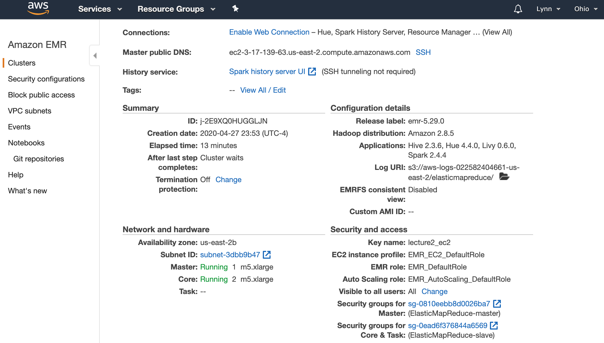
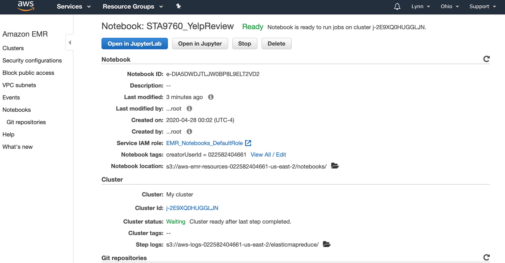

# STA9760_Project2_Yelp_Data_Analysis---Analyzing 10Gb of Yelp Reviews Data.
We will analyze a subset of Yelp's business, reviews and user data. This dataset comes to us from ##Kaggle## although we have taken steps to pull this data into a publis s3 bucket, and run the analysis via Jupyter Notebook and the expected output artifact is a .ipynb file deployed to Github.

**Yelp Business:**
s3://sta9760-yelpdataset1/yelp_academic_dataset_business.json

https://sta9760-yelpdataset1.s3.us-east-2.amazonaws.com/yelp_academic_dataset_business.json

**Yelp Review:**
s3://sta9760-yelpdataset1/yelp_academic_dataset_review.json

https://sta9760-yelpdataset1.s3.us-east-2.amazonaws.com/yelp_academic_dataset_review.json

**Yelp User:**
s3://sta9760-yelpdataset1/yelp_academic_dataset_user.json

https://sta9760-yelpdataset1.s3.us-east-2.amazonaws.com/yelp_academic_dataset_user.json

# Cluster and Notebook Configs

